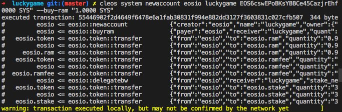
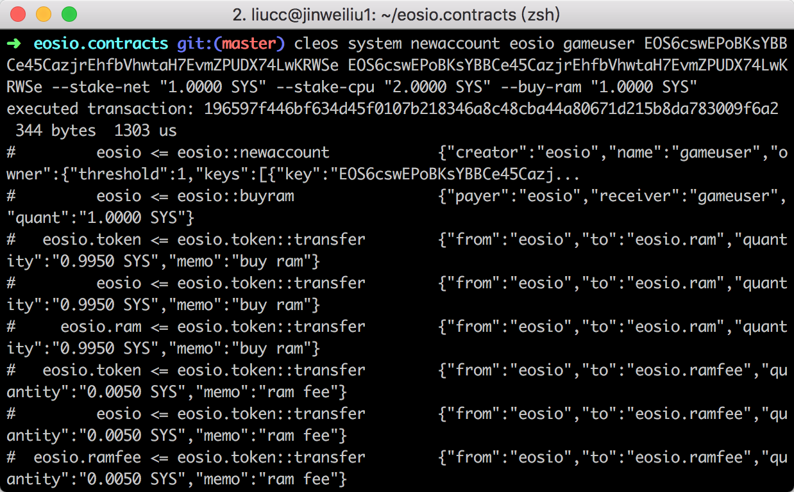
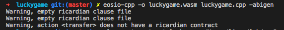
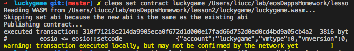
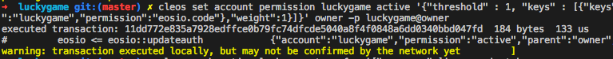
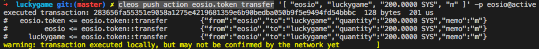
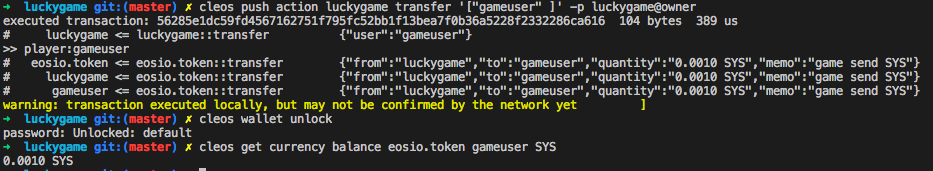

## 第2次作业


### 创建游戏合约账户
``` sh
 cleos system newaccount eosio luckygame EOS6cswEPoBKsYBBCe45CazjrEhfbVhwtaH7EvmZPUDX74LwKRWSe EOS6cswEPoBKsYBBCe45CazjrEhfbVhwtaH7EvmZPUDX74LwKRWSe --stake-net "1.0000 SYS" --stake-cpu "2.0000 SYS" --buy-ram "1.0000 SYS"
```


这个地方买的ram优点少 后面追加了
``` sh
 cleos system buyram luckygame luckygame "50 SYS"
 ```

### 创建玩家账户
``` sh
cleos system newaccount eosio gameuser EOS6cswEPoBKsYBBCe45CazjrEhfbVhwtaH7EvmZPUDX74LwKRWSe EOS6cswEPoBKsYBBCe45CazjrEhfbVhwtaH7EvmZPUDX74LwKRWSe --stake-net "1.0000 SYS" --stake-cpu "2.0000 SYS" --buy-ram "1.0000 SYS"
```



### 编写luckygame合约
``` c++
#include <eosiolib/eosio.hpp>
#include <eosiolib/print.hpp>
#include <eosiolib/asset.hpp>
#include <eosiolib/action.hpp>
#include <eosiolib/symbol.hpp>
#include <eosiolib/singleton.hpp>
#include <eosiolib/print.hpp>
#include <eosiolib/transaction.hpp>
#include <eosiolib/crypto.h> 
#include <eosiolib/dispatcher.hpp>

using namespace eosio;
using namespace std;
class luckygame : public contract{
    public:
        using contract::contract;
        [[eosio::action]]
        void transfer (name user){
            require_auth(_self);
            print("player:",name(user));
            
            //内联调用 语法说明
		    //action(
            //permission_level, //权限
            //code, 合约
            //action, 合约方法
            //data); 调用数据
            action(
                permission_level{_self,name("active")},
                name("eosio.token"),
                name("transfer"),
                std::make_tuple(_self,user,asset(10,symbol("SYS",4)),std::string("game send SYS"))
            ).send();


        }
};
EOSIO_DISPATCH(luckygame,(transfer));

```

### 编译游戏合约
``` sh
eosio-cpp -o luckygame.wasm luckygame.cpp -abigen
```



### 部署游戏合约
``` sh
cleos set contract luckygame /Users/liucc/lab/eosDappsHomework/lesson2/luckygame -p luckygame@owner
```


### 部署游戏合约
``` sh
cleos set account permission luckygame active '{"threshold" : 1, "keys" : [{"keys":"EOS6o1h1djZY7wW2oup91U3Sov2hdtcQUwjeoPqKzN2bmPomt5guz","weight":1}], "accounts" : [{"permission":{"actor":"luckygame","permission":"eosio.code"},"weight":1}]}' owner -p luckygame@owner
```


### 给合约账户luckygame充值200SYS
``` sh
 cleos push action eosio.token transfer '[ "eosio", "luckygame", "200.0000 SYS", "m" ]' -p eosio@active
```


### 调用transfer action
``` sh
cleos push action luckygame transfer '["gameuser" ]' -p luckygame@owner
```



